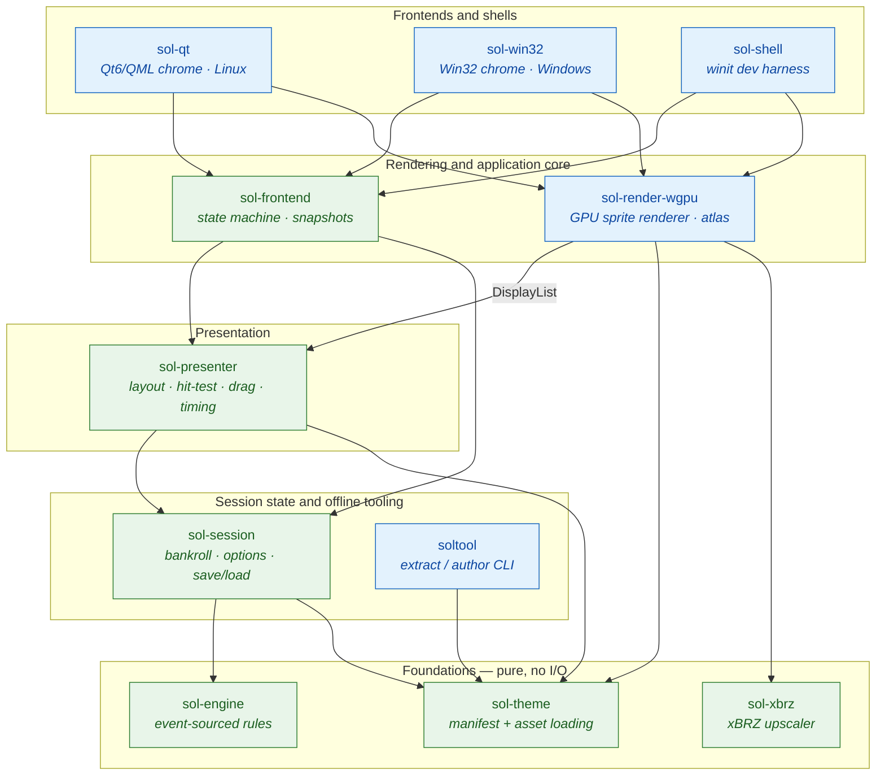

# classic-solitair

A Win98-faithful Klondike Solitaire, written in Rust as a Cargo workspace around a pure
event-sourced engine, wgpu rendering, and native Qt6/Win32 frontends. Licensed under
GPL-3.0-or-later.

## Install

Download a prebuilt binary for your platform from the
**[latest release](https://github.com/mhert/classic-solitair/releases/latest)**
([all releases](https://github.com/mhert/classic-solitair/releases)). Every
binary is self-contained — the default theme is embedded — so it runs out of the
box; `soltool` rides along with the desktop downloads, and a `SHA256SUMS` file
covers every artifact.

- **Windows** (`x86_64`): run the `-setup.exe` NSIS installer — it adds a
  Start-menu shortcut and an uninstaller — or unzip the portable `.zip`
  anywhere and run `classic-solitair.exe` from it.
- **Linux, any distro**: the `.AppImage` — a single self-contained file that
  bundles Qt6 and runs without installing anything:

  ```sh
  chmod +x Classic_Solitair-*.AppImage
  ./Classic_Solitair-*.AppImage
  ```

- **Debian / Ubuntu**: install the `.deb` built for your distro (Debian 13 and
  Ubuntu 24.04); it pulls its Qt6 runtime in through the package manager:

  ```sh
  sudo apt install ./classic-solitair_*_amd64_debian13.deb   # or …_ubuntu24.04.deb
  ```

- **Arch**: install the `.pkg.tar.zst` attached to the release with
  `sudo pacman -U`, or build it yourself from the `PKGBUILD` in
  [`packaging/arch/`](packaging/arch/PKGBUILD); it needs `qt6-base` and
  `qt6-declarative`.
- **From source**: the `.tar.gz` source tarball (or a clone of this repo)
  builds the Linux frontend and `soltool` with
  `cargo build --release -p sol-qt -p soltool` — the
  [Linux frontend](#linux-frontend) section lists the Qt development packages
  that needs. On Windows, build `sol-win32` instead.

> **Microsoft's original Solitaire artwork is never bundled with this project.** To play
> with the original look, run `soltool extract` against theme assets from your own
> licensed copy of Windows — the tool reads local files only; it never downloads or
> redistributes them.

In practice: point `soltool extract` at the `CARDS.DLL` from that licensed copy
(Win98 keeps it in `C:\WINDOWS\SYSTEM`; `SOL.EXE` works too — either file alone
yields the complete theme), and add `--animate` to reconstruct the original's
four animated card backs. With no `-o` the extracted theme lands straight in
the per-user themes directory, where the game discovers it — pick it in the
Options… dialog. Themes obtained any other way go into that same directory,
each one a theme folder or `.zip`.

No copy of Windows at hand? The Internet Archive preserves [Windows 98 SE as a
bootable CD image](https://archive.org/details/windows-98-se_202010) — and
there is no need to install, or even boot, it: on the CD, `CARDS.DLL` sits in
the cabinet `win98/WIN98_61.CAB` and `SOL.EXE` in `win98/WIN98_67.CAB`. On
Linux the CD image becomes a playable theme in three commands (`cabextract`'s
"can't find" warnings about neighbouring cabinets are harmless):

```sh
bsdtar -xf windows-98-se.iso win98/WIN98_61.CAB
cabextract -F cards.dll win98/WIN98_61.CAB
soltool extract --animate --name win98 cards.dll
# → ~/.local/share/classic-solitair/themes/win98
```

On Windows no extra tools are needed: double-click the `.iso` to mount it, open
`win98\WIN98_61.CAB` in Explorer (cabinets open like folders), copy `cards.dll`
out, and run:

```bat
soltool.exe extract --animate --name win98 cards.dll
:: → %APPDATA%\classic-solitair\themes\win98
```

## Game numbers

Games are numbered `0`–`32767`, and game *N* here is the same board the original
Windows Solitaire deals for *N*: the engine reproduces its shuffle exactly — the
Microsoft C runtime's `rand`, five passes of its swap shuffle, its deck order and
its layout. The original picks a game from the low 15 bits of a millisecond clock,
which is what makes 32,768 the whole range. Pick one with "Select Game…", or
`--seed`; the status bar always shows the current game's number.

## Workspace crates

| Crate | Role |
| --- | --- |
| `sol-engine` | Pure event-sourced Klondike rules; no I/O, no clock, no OS RNG (Gameplay context). |
| `sol-session` | Cross-game state — Vegas bankroll, options, versioned save/load (Session context). |
| `sol-theme` | Theme package format — manifest parsing, asset loading, validation. |
| `sol-xbrz` | Safe xBRZ pixel-art upscaler (one `scale_rgba`); the renderer's `png`-theme scaling primitive. |
| `sol-presenter` | Layout, hit-testing, drag logic, animation timing → sprite display lists. |
| `sol-render-wgpu` | Batched wgpu sprite renderer for the playfield. |
| `sol-frontend` | Shared, platform-free application core for the three frontends — theme discovery, state machine, chrome snapshots. |
| `soltool` | Asset extraction and theme authoring CLI. |
| `sol-shell` | Minimal winit dev shell to run presenter + renderer before real frontends. |
| `sol-qt` | Linux frontend — Qt6/QML chrome via cxx-qt, wgpu playfield. |
| `sol-win32` | Windows frontend — native-windows-gui chrome, Win32 menu bar, wgpu playfield. |

## Architecture

The workspace is organized as a stack of acyclic layers built on a *functional
core, imperative shell* split. Dependencies point in one direction only —
downward in the diagram below, toward a pure, deterministic domain that knows
nothing about pixels, the wall clock, or the operating system. No crate ever
depends on one above it. Everything from the rules to the on-screen layout can
be exercised headless, with no window and no GPU, because time, entropy, and
I/O are injected from the shell at the very top rather than reached for from
within.



*Green crates are the pure, deterministic core — no windowing, no GPU, time and
entropy handed in by the host. Blue crates are the imperative shell that owns
the OS, the GPU surface, and disk I/O. Subgraphs are dependency tiers; several
crates also depend directly on lower tiers for shared types, so the diagram
shows the defining edges rather than every arrow.*

**Foundations — `sol-engine`, `sol-theme`, `sol-xbrz`.** The engine is
event-sourced: a player intent enters as a `Command`, `decide` validates it
against the rules and materializes every consequence (moves, auto-flips, score
deltas, the win) as `Event`s, and `evolve` folds those events into a
`GameState` with no rule knowledge at all. A `Game` is nothing more than its
`(seed, log)`, so undo/redo is log surgery followed by replay, and wall-clock
time enters solely through `Command::Tick` — there is no clock and no RNG
inside (the *Gameplay context*). `sol-theme` handles the theme-package format in
two tiers of its own: a pure manifest layer over `theme.toml`, and a
byte-oriented loading layer that reads every asset through a single
`AssetSource` boundary, with the only filesystem and zip code isolated behind
`DirSource` and `ZipSource`. `sol-xbrz` is a single pure function that upscales
pixel-art card faces — the renderer's only scaling primitive, and the one crate
licensed `GPL-3.0-only` because the xBRZ port it wraps is.

**Session state and tooling — `sol-session`, `soltool`.** `sol-session` holds
everything that outlives a single deal — the Vegas bankroll, user options, and
versioned save/load — and owns exactly one running `Game` at all times, so there
is always a deal on the table (Win98-faithful). Its state is platform-free;
only its `paths` and `storage` modules touch disk (the *Session context*).
`soltool` is a standalone CLI built on `sol-theme` alone; it is offline
extraction and authoring tooling, deliberately outside the running game's
dependency graph.

**Presentation — `sol-presenter`.** The platform-neutral bridge between the
rules (reached through the owned `Session`) and whatever ends up drawing.
Frontends feed it pointer and key events plus `advance(dt)` time and drive its
command/query API from their menus; in return it emits a `DisplayList` of
sprites. No rendering-API type appears anywhere inside it, and it reads neither
a clock nor the OS, which is what keeps it portable to future wasm and Android
shells.

**Rendering and application core — `sol-render-wgpu`, `sol-frontend`.** These
are siblings, not a stack: the application core is deliberately
render-agnostic. `sol-render-wgpu` consumes the presenter's `DisplayList` — the
finalized presenter → renderer seam — and draws it with one batched
textured-quad pipeline over a texture atlas built from the loaded `Theme`; the
frontend owns the window, surface, and device, while this crate only turns
lists into draws. `sol-frontend` is the platform-free core the three frontends
share: theme discovery, the application state machine, the plain-data snapshots
the chrome renders (menu model, status line, options, back-picker previews),
and cutting a rendered card-back sheet into thumbnails. It depends on no
windowing toolkit and no renderer, so it is tested without a display and gated
exactly like the domain crates beneath it.

**Frontends and shells — `sol-qt`, `sol-win32`, `sol-shell`.** The imperative
shell. Each owns a native window, its platform's chrome, and the GPU surface,
and each wires `sol-frontend` together with `sol-render-wgpu`. They agree on
everything except chrome and render path: `sol-qt` draws Qt6/QML menus and
dialogs on Linux, `sol-win32` a native Win32 menu bar on Windows, and
`sol-shell` is a keyboard-driven winit harness for running the game before
either real frontend is in play.

**The seams.** Four named boundaries carry everything that crosses between
layers, and each is inert data with no behavior of its own: `Command` and
`Event` between a caller and the engine, `DisplayList` between the presenter and
any renderer, `AssetSource` between a theme and its bytes on disk, and the
snapshot structs between the application core and each platform's chrome.
Because every seam is plain data, each layer can be tested against recorded
values from its neighbors, and a whole new frontend — the planned wasm and
macOS shells among them — can be added without touching anything below it.

**Enforced discipline.** The purity is mechanical, not conventional.
`unsafe_code` is `forbid`-level across the whole workspace, the renderer and the
dev shell included; only the two native frontends step down to `deny` — `sol-qt`
for its cxx-qt bridge, `sol-win32` for the wgpu-surface handoff and the raw
Win32 input path — where a handful of scoped, `// SAFETY:`-commented blocks pass
native window handles across the FFI boundary. The no-panic set is enforced the
same way: `unwrap`, `expect`, `panic`, `todo`, `unimplemented`, and slice
indexing are all `deny`-level clippy lints, so a core crate cannot quietly reach
for a panic or an unchecked index.

## `soltool`

The asset extraction and theme authoring CLI. Subcommands:

- `extract <sol.exe | cards.dll | dir-of-bitmaps> [-o <theme-dir>] [--name
  <name>] [--animate]` — pull card bitmaps from your own local Windows
  assets into a `render_mode = "png"` theme. **Output is for your local use
  only — the original artwork must never be redistributed or committed**
  (the tool reads local files only; it never downloads or ships them).
  With no `-o`/`--output`, the theme is written to the per-user themes
  directory as `<data>/themes/<name>` and is immediately selectable
  in-game. `--name` sets the theme's name and, when `-o` is omitted, its
  folder under the themes directory (default: the input file's stem).
  `--animate` reconstructs the four animated card backs from the resource
  file's own overlay sprites; it takes a resource input only, and is a
  usage error on a loose directory, which already packs frame-numbered
  files into strips itself.
- `validate <theme>` — lint a theme package against the theme format rules;
  non-zero exit on failure.
- `pack-strip <frame files…> -o <strip.png> --fps <n>` — pack loose frames into
  one horizontal strip PNG and print a ready-to-paste `[backs]` snippet.

## Linux frontend

`sol-qt` is the real Linux frontend: Qt6/QML menus, dialogs, and status
bar (with the current game's seed always visible and copyable) around
the wgpu-rendered playfield. Building it needs the Qt 6 development
packages for QtQuick — `qt6-base` and `qt6-declarative` on Arch,
`qt6-base-dev` and `qt6-declarative-dev` (plus the `qml6-module-qtquick*`
runtime modules) on Debian/Ubuntu — with `qmake6` on `PATH`.

```sh
cargo run -p sol-qt                        # default theme, random deal
cargo run -p sol-qt -- --seed 42           # deal game 42 (0–32767)
cargo run -p sol-qt -- --theme <path>      # any theme dir or zip
```

Everything else is in the menus: Game (Deal `F2`, Select Game…, Undo
`Ctrl+Z`, Redo `Ctrl+Y`, Save, Load, Options…, Exit) and Help (About).
The Options dialog picks draw mode, scoring, timed play, outline
dragging, keep-Vegas-score, sounds, card scaling and the theme; the card
back is picked from a grid of live thumbnails, animated backs included.
Theme, back and scaling all preview live on the board behind the dialog,
with Cancel putting them back. User themes are discovered in
`~/.local/share/classic-solitair/themes/` (each a theme directory or
`.zip`), which is where `soltool extract` output belongs. The playfield
renders offscreen through wgpu and enters the QML scene as an ordinary
texture, so Wayland and X11 behave identically (rationale in the crate's
docs).

## Windows frontend

`sol-win32` is the Windows frontend: a real Win32 window with a native
menu bar, status bar and dialogs (`native-windows-gui`) around the same
wgpu-rendered playfield, drawn straight onto the window's child canvas.
It needs no extra system packages beyond a Windows toolchain.

```sh
cargo run -p sol-win32                     # default theme, random deal
cargo run -p sol-win32 -- --seed 42        # deal game 42 (0–32767)
cargo run -p sol-win32 -- --theme <path>   # any theme dir or zip
```

The menus, options and theme discovery match the Linux frontend exactly —
both drive the same `sol-frontend` core — except that user themes are
discovered under `%APPDATA%\classic-solitair\themes\`. The status bar's
seed part is click-to-copy.

Cross-compiling from Linux works locally with the `x86_64-pc-windows-gnu`
target (and the tests run under wine), but **no CI job gates it**: the
Windows job on CI builds and tests natively, so a cross-build regression
would only surface on a developer's machine.

## Dev shell

`sol-shell` is the winit development shell: a fully playable game (deal,
draw, drag-and-drop, double-click to foundation, undo/redo, save/load,
win cascade) with keyboard shortcuts standing in for the real frontends'
menus. Run it with:

```sh
cargo run -p sol-shell                     # default theme, random deal
cargo run -p sol-shell -- --seed 42        # deal game 42 (0–32767)
cargo run -p sol-shell -- --theme <path>   # any theme dir or zip
```

`--help` (also printed at startup) lists the shortcuts: `F2` new deal,
`G <digits> Enter` select game by seed, `Ctrl+Z`/`Ctrl+Y` undo/redo,
`Ctrl+S`/`Ctrl+O` save/load, `D`/`M`/`T` draw mode/scoring/timed (next
deal), `O` outline dragging, `B` cycle card back, `Esc` quit. The board
fills the window: cards scale continuously with the window height and
the tableau columns spread across the width exactly as the original
did; windows narrower than the design aspect fill the width instead,
with felt below.

## Default theme

`themes/default/` is the in-tree default theme: 52 original vector card faces, a
static back, and a 2-frame animated back, all `render_mode = "vector"`. Every
asset is CC0-1.0 (see `themes/default/LICENSE`) — original geometric shapes with
no `<text>` elements (rank glyphs are drawn as paths, so rendering never depends
on fonts installed at raster time) and no copied deck art, so it ships in the
repo and is distributed freely, unlike the Win98 original theme above.

The whole package is produced by a deterministic, stdlib-only generator; nothing
under `themes/default/` is hand-edited except `LICENSE` and the generator
itself. Regenerate it with:

```sh
python3 themes/default/generate.py
```
